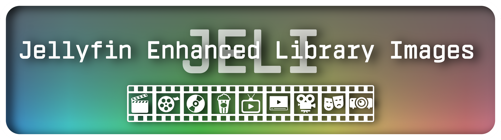
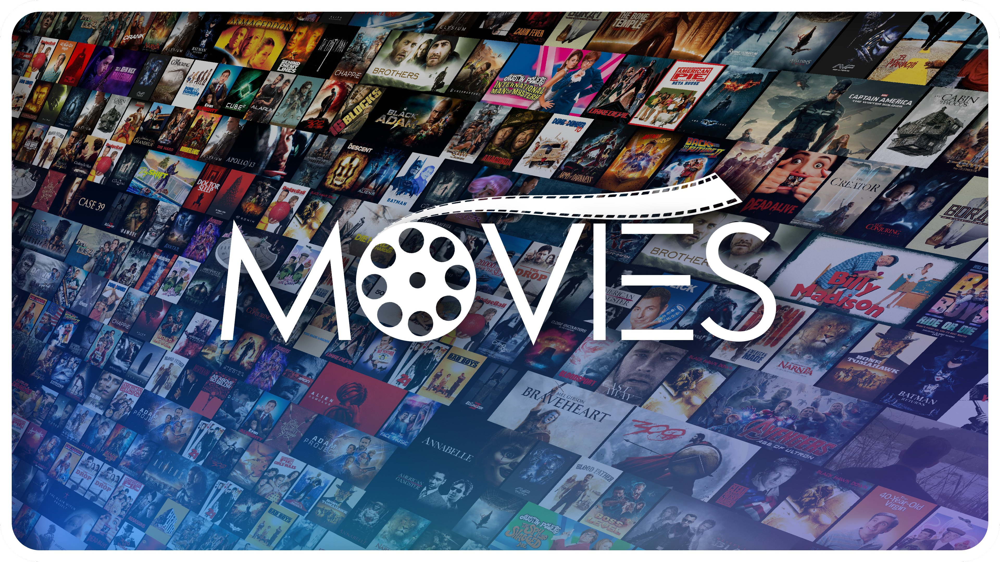
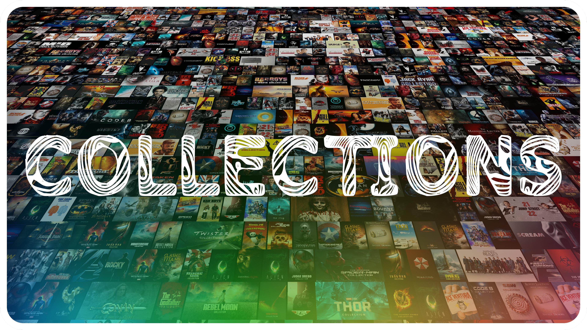
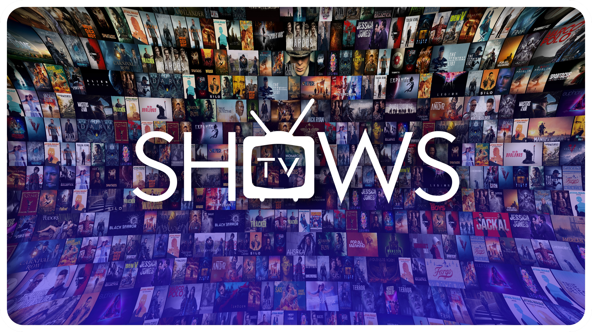

<div align="center">



# JELI — Jellyfin Enhanced Library Images

**Perspective poster-wall splash screens for Jellyfin**

[](https://jellyfin.org)
[](https://github.com/Synthmania89/jellyfin-plugin-jeli/releases)
[](LICENSE)

</div>

---

## What is JELI?

JELI is a Jellyfin plugin that automatically generates beautiful **perspective thumbnail splash screens for your library content**, built directly from each media library's own posters, thumbs, and backdrops. Instead of a plain folder icon, each library gets a cinematic background image — a wall of your own content warped into one of 6 stunning perspective views, with optional custom overlays and text.

<div align="center">

| ↘ Diagonal | ⬆ Floor | ⊙ Barrel |
|:-----------:|:--------:|:---------:|
|  |  |  |

</div>

---

## Features

- 🎬 **6 Perspective Modes** — Diagonal (↘ ↙), Floor, Ceiling, Barrel/Wide-angle, and Flat Wall
- 🖼️ **6 Image Source Modes** — Posters, Thumbs, Backdrops, and all combinations
- 🎨 **Per-Library Overlays** — Upload any PNG/JPG to composite on top of the wall
- 🔤 **Text Layers** — Add library name or custom text with full font, size, color, shadow controls
- 🅰️ **Custom Fonts** — Upload your own TTF/OTF fonts; comes with **10 bundled fonts** ready to use
- 📐 **1080p & 4K Output** — Full resolution support with fast bitmap caching (~3 second generation)
- ⏰ **Auto-Schedule** — Daily at a set time, or every N hours
- 🗂️ **Generations Manager** — View, preview, download, or delete all generated images
- 🎛️ **Live Preview** — Resolution-aware canvas preview before generating
- 🎁 **4 Bundled Overlays** — Two gradient styles (standard + dark), each in 1080p and 4K

---

## Installation

### Method 1 — Plugin Repository (Recommended)

1. In Jellyfin, go to **Dashboard → Plugins → Repositories**
2. Click **Add**, paste this URL and save:
   ```
   https://raw.githubusercontent.com/Synthmania89/jellyfin-plugin-jeli/main/manifest.json
   ```
3. Go to **Dashboard → Plugins → Catalog**
4. Search for **JELI** and click **Install**
5. **Restart Jellyfin**

### Method 2 — Manual Install

1. Download the latest `jellyfin-plugin-jeli_v*.zip` from [Releases](https://github.com/Synthmania89/jellyfin-plugin-jeli/releases)
2. Extract the 3 files (`Jellyfin.Plugin.Jeli.dll`, `meta.json`, `thumb.jpg`) into your Jellyfin plugins folder:
   ```
   Windows:  %AppData%\Jellyfin\plugins\Jeli\
   Linux:    /var/lib/jellyfin/plugins/Jeli/
   Docker:   /config/plugins/Jeli/
   ```
3. **Restart Jellyfin**

> **Note:** The plugin folder must be named exactly `Jeli` (capital J, lowercase rest).

---

## Getting Started

After installation, go to **Dashboard → Plugins → JELI (Enhanced Library Images)**.

### Quick Setup

1. **Select a library** from the left sidebar
2. **Enable** it with the toggle
3. Choose your **Resolution** (1080p or 4K)
4. Choose an **Image Source** (Posters, Backdrops, or a combination)
5. Pick a **Perspective** mode and see the sketch preview
6. Optionally assign an **Overlay** from the built-in gradients
7. Click **▶ Generate** — done in seconds!

### Per-Library Configuration

Each library has independent settings:

| Setting | Description |
|---------|-------------|
| Resolution | 1920×1080 or 3840×2160 |
| Image Source | Posters / Thumbs / Backdrops / combinations |
| Perspective | 6 modes with visual sketch preview |
| Overlay | PNG/JPG composited over the wall |
| Overlay Scale | Stretch, Fit, Fill, or Custom position |
| Text Layers | Multiple text layers with full styling |

### Text Layers

Add one or more text layers per library with:
- **Font** (bundled or uploaded custom fonts)
- **Size, Color, Bold, Italic**
- **Position** (9 presets + custom X/Y)
- **Padding, Shadow** (color + offset)
- Toggle between **library name** or **custom text**

---

## Perspective Modes

| Mode | Description |
|------|-------------|
| ↘ Diagonal top-right | Original Jellyfin look — wall recedes to top-right |
| ↙ Diagonal top-left | Mirror — wall recedes to top-left |
| ⬆ Floor | Symmetric floor view — vanishing point at center-top |
| ⬇ Ceiling | Symmetric ceiling view — vanishing point at center-bottom |
| ⊙ Barrel / Wide-angle | Radial barrel distortion — wall curves outward |
| ▦ Flat Wall | Straight-on mosaic — no perspective distortion |

---

## Auto-Schedule

In the **Global Settings** tab:
- Enable **Auto-Schedule**
- Choose **Daily** (set a time, e.g. 03:00 AM) or **Interval** (every N hours)
- Save — the Jellyfin scheduled task updates immediately, no restart needed

---

## Custom Overlays & Fonts

### Overlays Tab
Upload any PNG/JPG as an overlay. Four gradient overlays are bundled and ready to use immediately after install:
- `Jeli-default-overlay-1080p.png` — colourful gradient for 1080p
- `Jeli-default-overlay-4k.png` — colourful gradient for 4K
- `Jeli-default-overlay-clear-1080p.png` — dark/clear gradient for 1080p
- `Jeli-default-overlay-clear-4k.png` — dark/clear gradient for 4K

### Fonts Tab
Upload your own TTF/OTF fonts. 10 bundled fonts available immediately:
- **Pasajero** — clean geometric sans-serif
- **Candy Kisses** — decorative display font
- **Disney Script** — flowing script font
- **Cathode** — retro CRT-style font
- **Vin Mono Pro Medium** — clean monospace
- **Neon Light** — glowing neon-tube style
- **CassandraTwo** — display font
- **Budmo Jigglish** / **Budmo Jiggler** — playful wobbly display fonts
- **CarnavaleDelight** — decorative display font

---

## Building from Source

Requirements: [.NET 9.0 SDK](https://dotnet.microsoft.com/download/dotnet/9.0)

```bash
git clone https://github.com/Synthmania89/jellyfin-plugin-jeli.git
cd jellyfin-plugin-jeli
dotnet build -c Release
```

The compiled DLL will be at `bin/Release/net9.0/Jellyfin.Plugin.Jeli.dll`.

To deploy manually: copy `Jellyfin.Plugin.Jeli.dll` + `meta.json` + `Web/thumb.jpg` into your Jellyfin plugins `Jeli/` folder.

---

## Compatibility

| JELI Version | Jellyfin Version |
|:---:|:---:|
| 1.2.0.1 | 10.11.11 |

---

## How It Works

1. **Wall Build** — Collects posters/thumbs/backdrops from your library, decodes and caches them all at row height, then tiles them across a giant canvas (30720×12960 at 4K). Uses random-with-replacement selection so the wall is always full regardless of library size.
2. **Perspective Warp** — Each output pixel is computed via an inverse projective warp (or for Barrel mode, a radial r² distortion) that maps it to the correct position in the giant wall. All done with unsafe direct pixel access for speed.
3. **Composite** — The optional overlay PNG is blended on top, followed by any text layers rendered with the selected font.
4. **Save** — Output saved as JPEG to `plugins/configurations/Jeli/generated/` and optionally set as the Jellyfin library image automatically.

---

## Windows Server / Performance Notes

If generation is slow on Windows, add Jellyfin paths to **Windows Defender exclusions**. Real-time AV scanning of image files during generation can dramatically increase processing time.

---

## License

MIT License — see [LICENSE](LICENSE)

---

## Credits

- Built by **Synthmania**
- Perspective algorithm inspired by the Jellyfin web source and Python PIL reference implementation
- Fonts: 10 bundled fonts including Pasajero, Candy Kisses, Disney Script, Cathode, and more
- Built with [SkiaSharp](https://github.com/mono/SkiaSharp) 2.88.x

---

<div align="center">

**[⭐ Star this repo](https://github.com/Synthmania89/jellyfin-plugin-jeli) · [🐛 Report a bug](https://github.com/Synthmania89/jellyfin-plugin-jeli/issues) · [💡 Request a feature](https://github.com/Synthmania89/jellyfin-plugin-jeli/issues)**

</div>
